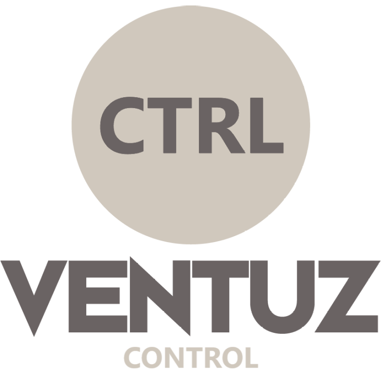

# VZCTRL – VentuZ ConTRoL

[](https://www.gnu.org/licenses/gpl-3.0.html)
[](https://dotnet.microsoft.com/)
[](https://ventuz.com)
[](#-pro-version-features)
[](https://github.com/mo-tion-interactive/VZCTRL)

<div align="center">
  
  
  ### ⚙️ Open-source Ventuz Control Tool with optional Pro Edition
  
  *Professionelle Fernsteuerung für Ventuz Real-Time Graphics Software*
</div>

---

## 📖 Über VZCTRL

**VZCTRL** ist ein leistungsstarkes, quelloffenes Steuerungstool für die Echtzeit-Grafiksoftware **Ventuz**. Es ermöglicht die nahtlose Fernsteuerung und Integration von Ventuz-Projekten in professionelle Produktionsumgebungen.

Die **Community Edition** bietet solide Grundfunktionen für die tägliche Arbeit, während die **Pro-Version** mit dem innovativen Control Panel und erweiterten Features für anspruchsvolle Live-Produktionen ausgestattet ist.

### 🎯 Hauptanwendungsbereiche

- **Live-Events & Shows**: Echtzeit-Steuerung von Grafiken und Animationen
- **Broadcast-Produktionen**: Professionelle Integration in TV-Studios
- **Corporate Events**: Nahtlose Präsentationssteuerung
- **Messen & Ausstellungen**: Interaktive Display-Kontrolle

---

## 🚀 Features (Community Edition)

- Verbindung zu Ventuz über Netzwerk
- Steuerung von Szenen, Layern und Parametern
- Einfache Konfigurierbarkeit
- Offen für Erweiterungen

---
## 🌟 Pro-Version Features

Die **VZCTRL Pro Edition** bietet zusätzliche Funktionen für professionelle Anwender und Produktionen:

- 🌐 **Mehrsprachigkeit**  
  Benutzeroberfläche in mehreren Sprachen (z. B. Deutsch, Englisch)

- 🖥️ **Professionelles Control Panel**  
  Erweiterte Steuerungsoberfläche für Live-Show-Control und Broadcast-Produktionen

- 🛠️ **Erweiterte Funktionen**  
  Zusätzliche Steuerkommandos, Preset-System, Projektverwaltung, Multi-Monitor-Support

- 🎯 **Development Tools**  
  Erweiterte Debugging-Features, Performance-Monitoring, Logging-System

> 🔐 **Pro-Version & Lizenzen:**  
> [www.vzctrl.com](https://vzctrl.mo-tion.at)  
> 📩 contact@mo-tion.at

---
## 🔧 Installation & Nutzung

**Systemvoraussetzungen:**

- Windows 10 / 11  
- .NET 8.0 oder höher  
- Ventuz 8.x mit aktiviertem Remote-Zugriff

**Installation:**

```bash
git clone https://github.com/mo-tion-interactive/VZCTRL.git
cd VZCTRL
dotnet run
```

---

## 📚 Dokumentation & Ressourcen

### 🌐 Offizielle Website
- **Homepage**: [www.vzctrl.com](https://vzctrl.mo-tion.at)
- **Lizenzierung**: [www.vzctrl.com/license](https://vzctrl.mo-tion.at/license)
- **Dokumentation**: [www.vzctrl.com/documentation](https://vzctrl.mo-tion.at/documentation)
- **Galerie**: [www.vzctrl.com/gallery](https://vzctrl.mo-tion.at/gallery)
- **Über uns**: [www.vzctrl.com/about](https://vzctrl.mo-tion.at/about)

## 📚 Dokumentation & Support

### 📖 Weiterführende Dokumentation
- [Benutzerhandbuch](https://vzctrl.mo-tion.at/documentation) 
- [Getting Started](https://vzctrl.mo-tion.at/documentation#getting-started)
- [API-Referenz](https://vzctrl.mo-tion.at/documentation#api-reference)
- [Download](https://vzctrl.mo-tion.at/documentation#download)
- [Support](https://vzctrl.mo-tion.at/documentation#support)

### 🐛 Problembehandlung

**Häufige Probleme:**
- **Verbindungsfehler**: Firewall-Einstellungen und Ventuz Remote-Access prüfen
- **Performance-Issues**: Netzwerklatenz und Systemressourcen überprüfen
- **UI-Probleme**: .NET-Runtime-Version validieren

### 💬 Community & Support

- **Issues**: [GitHub Issues](https://github.com/mo-tion-interactive/VZCTRL/issues)
- **Diskussionen**: [GitHub Discussions](https://github.com/mo-tion-interactive/VZCTRL/discussions)
- **Pro-Support**: contact@mo-tion.at
- **Website**: [www.vzctrl.com](https://vzctrl.mo-tion.at)

---

## 🤝 Mitwirken

Wir freuen uns über Beiträge zur Community Edition! 

### 📝 Contribution Guidelines

1. **Fork** das Repository
2. **Feature Branch** erstellen (`git checkout -b feature/AmazingFeature`)
3. **Commits** mit aussagekräftigen Nachrichten
4. **Tests** hinzufügen/aktualisieren
5. **Pull Request** erstellen

---

### 🔐 Lizenz-Hinweise

- **Community Edition**: GPL-3.0 (Open Source)
- **Pro Edition**: Kommerzielle Lizenz erforderlich ([www.vzctrl.com/license](https://vzctrl.mo-tion.at/license))

---

## 🙏 Danksagungen

- **Ventuz Team** für die hervorragende Real-Time Graphics Software
- **Community Contributors** für Feedback und Verbesserungen
- **Beta-Tester** für ausführliche Tests und Rückmeldungen

---

## 📞 Kontakt

**Projekt-Maintainer**: [LorenzG2006](https://github.com/LorenzG2006)  
**Pro-Version**: [www.vzctrl.com](https://vzctrl.mo-tion.at)  
**Support**: contact@mo-tion.at  
**Community**: GitHub Issues & Discussions

---

<div align="center">
  
  **🌟 Gefällt Ihnen VZCTRL? Geben Sie uns einen Stern! 🌟**
  
  *Entwickelt mit ❤️ für die Ventuz-Community*
  
</div>
